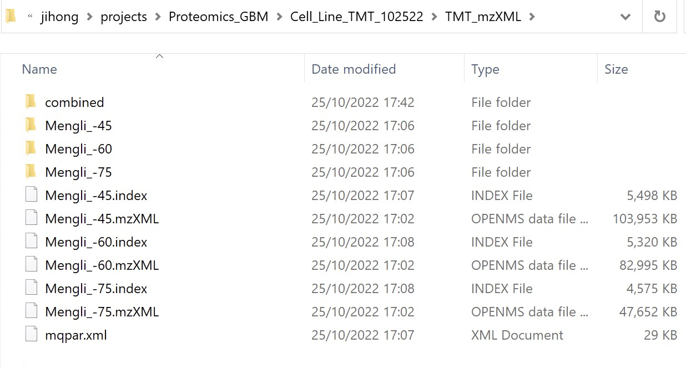
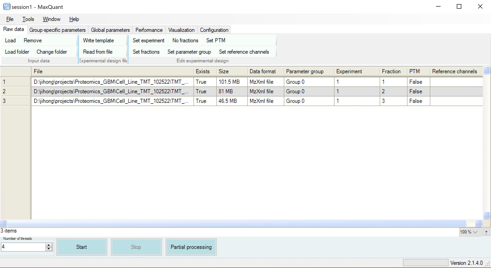
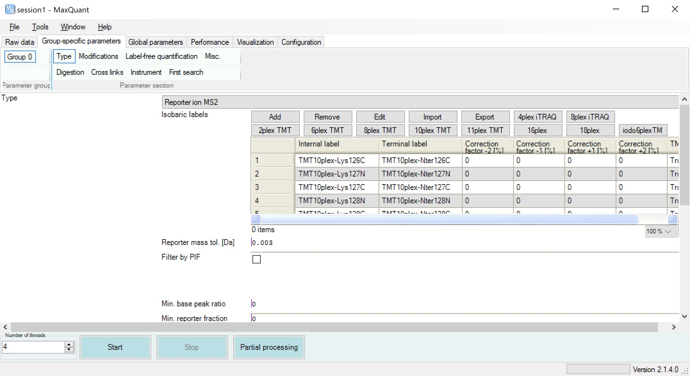
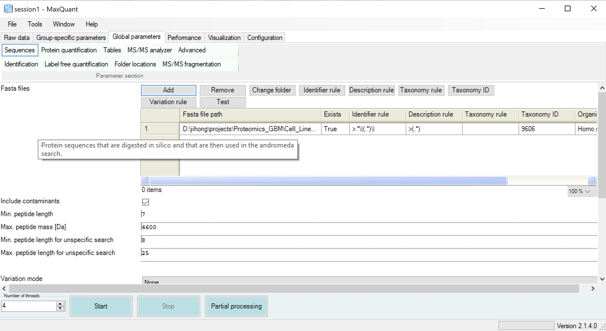
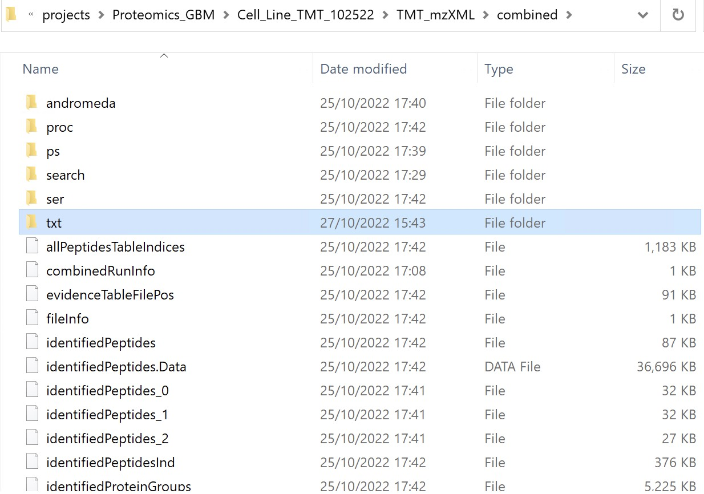
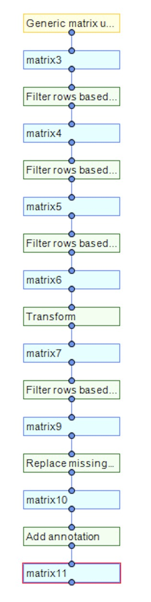

[TOC levels=1-3]: ##

# Table of Contents
- [Table of Contents](#table-of-contents)
- [Name](#name)
- [Purpose](#purpose)
- [Part0 - Software Information and Data Storage](#part0---software-information-and-data-storage)
  - [0.1 Software Information](#01-software-information)
  - [0.2 Data Storage](#02-data-storage)
- [Part1 - Quantification of TMT proteomics data (MaxQuant)](#part1---quantification-of-tmt-proteomics-data-maxquant)
  - [1.1 Raw Data Loading](#11-raw-data-loading)
  - [1.2 Searching Parameters Setting](#12-searching-parameters-setting)
  - [1.3 Reference Sequence File Loading](#13-reference-sequence-file-loading)
  - [1.4 MS data quantification start](#14-ms-data-quantification-start)
- [Part2 - Preprocessing of quantification results (Persus)](#part2---preprocessing-of-quantification-results-persus)
- [Reference](#reference)

# Name
Proteomics Quantification MQ: Document the proteomics quantification pipeline based on MaxQuant for TMT labeled MS data 

# Purpose
* Document the detailed methods to quantify proteomics data from raw TMT labeled MS data using softwares: MaxQuant and Persus.
* GBM cell line proteomics data was used as the example and mainly document for future replication of the analysis 

# Part0 - Software Information and Data Storage
## 0.1 Software Information
The two main softwares used in the quantification of TMT labeled proteomics mass spectrometry data are [MaxQuant](http://coxdocs.org/doku.php?id=maxquant:start) and [Persus](http://coxdocs.org/doku.php?id=perseus:start). They are all downloaded from the offical website and installed on the WangLab Proteomics Windows Server. 

The whole GBM cell lines proteomics data quantification work was finally done in October 25, 2022. The software versions are 2.1.4.0 for MaxQuant and 2.0.5.0 for Persus.

## 0.2 Data Storage
The data was stored on the Windows Server under the path: `D:\jihong\projects\Proteomics_GBM\Cell_Line_TMT_102522`

The folder contains the raw reference sequence fasta file and one subfolder called TMT_mzXML, all the raw MS data and quantification results are in the subfolder. 

The three mzXML files with prefix as Mengli are the raw MS data from the BioCRF, and all the left data files are the middle and final results of MQ software. 

# Part1 - Quantification of TMT proteomics data (MaxQuant)
The GBM cell line TMT labeled MS data was quantificated using MaxQuant, one well known proteomics analysis software with Graphic User Interface(GUI). Therefore, the overall analysis logic is: 
- Load necessary files including raw MS data and reference fasta file into the software;
- Set the software analysis parameters for the specific MS type, TMT-10plex here;
- Select CPU cores for the analysis work and click the **START** button.

All the parameters including the path to loaded file are stored in one .xml file for further usage and replication. The setting files for this example work has been stored here, named as [mqpar.xml](mqpar.xml).

## 1.1 Raw Data Loading
Step1: Raw data could be loading into the software (Set the file path for raw data) by click the **Load** or **Load folder** button in the **Raw data** panel, as shown below.

Step2: Click the button **Set experiment** to set the experiment index parameter, since the MS raw data are obtained by one single MS run, the index for three files could be easily set as the same 1.

Step3: Click the button **Set fractions** to set the MS fraction parameter, since the three MS raw data files coming from three different LC fractions, the fraction index here should be set from 1 to 3.

## 1.2 Searching Parameters Setting 
We need to set the search parameters based on the MS labeling methods. Here, we need to set it as TMT-10plex. 

Step1: Click the panel button **Group-specific parameters** to get into the parameters setting panel

Step2: Click the button **Type**, scroll down the top **Type**, and select **Reporter ion MS2**. This step is to set the search mode to MS2 based methods. 

Step3: Click the button **10plex TMT**.

All the other parameters could be left as default for simple usage. For some work specifically focusing on certain aims, other parameters could be changed under user's own demand. 

## 1.3 Reference Sequence File Loading
The reference protein sequence library should be provided for the quantification work. The fasta file used for this example work is also stored here, named as [UP000005640_9606_MGMT_100722.fasta](UP000005640_9606_MGMT_100722.fasta). This protein reference library contains all the canonical protein downloaded from Uniprot and the specific MGMT isoform (user interesting one).

Step1: Click the panel button **Global parameters** to get into the parameters setting panel

Step2: Click the button **Sequence**, and then click the button **Add** to add the protein reference sequence file.

## 1.4 MS data quantification start
Ater all the files are loaded and all the parameters are setted, select core numbers on the left-down corner of the software and click the button **Start**.

After several hours' searching, the raw results will be stored in the subfolder **combined**. And the raw result files are under the **txt** subfolder.

Therefore, the final path of the MS quantification raw result files is `D:\jihong\projects\Proteomics_GBM\Cell_Line_TMT_102522\TMT_mzXML\combined\txt`. The result file we could use for further preprocessing is called **proteinGroups.txt**, and it has also been stored [here](proteinGroups.txt).

# Part2 - Preprocessing of quantification results (Persus)
After we get the result **proteinGroups.txt** file, we could use different methods to preprocess the result, such as R, Excel, and the Persus software combined with MaxQuant. 

The main aim of preprocessing is to filter out three kinds of wasted proteins in the results file: 
- Only identified by site
- Reverse
- Potential contaminant

All the protein rows with these markers (+ in these three columns) should be removed from the raw results, and the columns with prefix **Reporter intensity corrected** are the final quantification reults. 

Such filtering work can be easily done in Excel or R or Python for your own preference. 

Persus can be also used to do such kind of work, and it may provide direct view of the data since it is one software with GUI. The parameter files for preprocessing the result have been also stored here, named as [CellLine_TMT_1025.sps](CellLine_TMT_1025.sps). In addition, the filtering pipeline could been seen as below.

# Reference
- MaxQuant [Documentation](http://coxdocs.org/doku.php?id=maxquant:start); [Learning Video](https://www.youtube.com/channel/UCKYzYTm1cnmc0CFAMhxDO8w/videos)
- Persus [Documentation](http://coxdocs.org/doku.php?id=perseus:start); [Learning Video](https://www.youtube.com/channel/UCKYzYTm1cnmc0CFAMhxDO8w/videos)